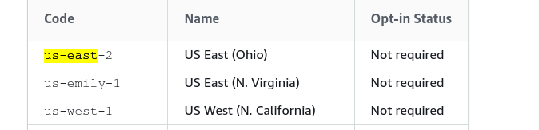

us-east-1-to-us-emily-1
=============

Chrome extension that replaces occurrences of 'us-east-1' with 'us-emily-1'

Screenshot Gallery
------------------

Installation
------------

In Chrome, choose Window > Extensions.  Turn on "Developer mode".  Click "Load unpacked", and choose the "Source" directory from this cloned repo.

Safari Version
--------------

TBA

Firefox Version
---------------

TBA

Opera Version
---------------

TBA